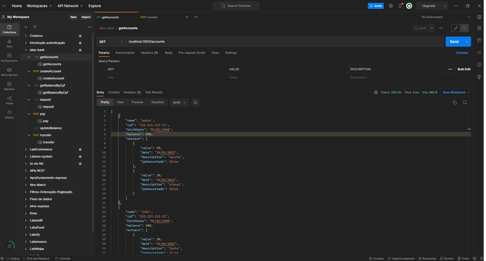
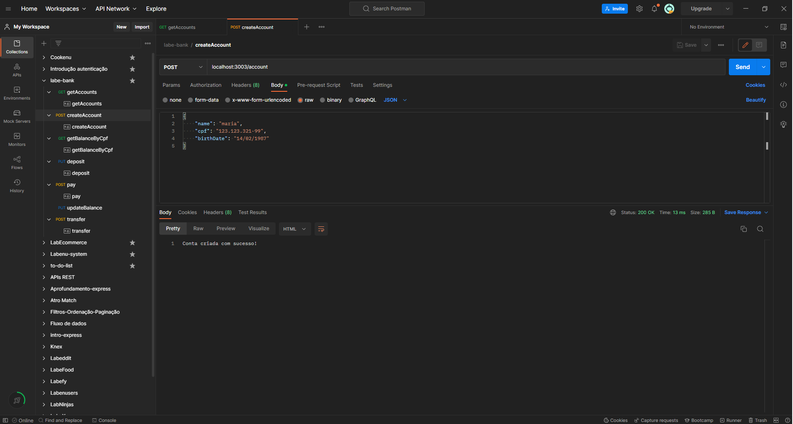
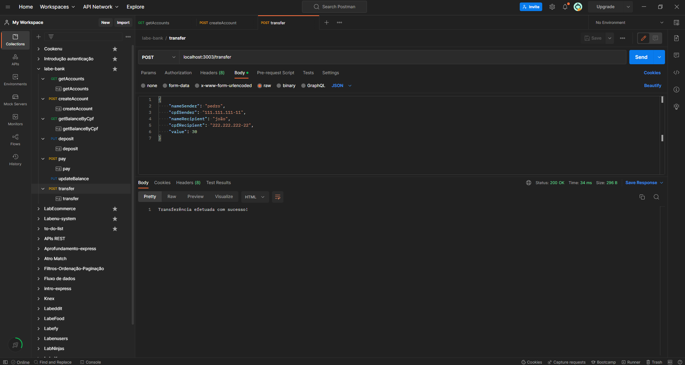

# `Projeto`
Sistema bancário

# `Descrição`
O Projeto Sistema bancário-backend foi desenvolvido como uma atividade dentro do curso Full-Stack Web Developer da Labenu, o qual consiste na elaboração de uma API que retorna dados conforme as requisições enviadas. Trata-se de uma ferramenta básica que simula o funcionamento de um banco.

A documentação da API pode ser acessada [aqui](https://documenter.getpostman.com/view/21552787/2s7YfU5rLx).

# `Modo de usar`
As requisições que podem ser feitas são:  

- **[GET] getAccounts:** busca todas as contas cadastradas. Com as informações do nome do usuário, cpf, data de nascimento, saldo e extrato.
- **[POST] createAccount:** cria uma nova conta, fornecendo (via body) nome, cpf e data de nascimento.
- **[GET] getBalanceByCpf:** busca o saldo de uma conta, fornecendo (via body) o cpf do usuário.
- **[PUT] deposit:** faz o depósito de saldo em uma conta, fornecendo (via body) o nome, cpf e valor.
- **[POST] pay:** faz o pagamento de uma conta, fornecendo (via body) o cpf, descrição, valor e data.
- **[PUT] updateBalance:** atualiza o saldo de um usuário.
- **[POST] transfer:** faz uma transferência de valor entre contas, fornecendo (via body) o nome e cpf do remetente, nome e cpf do destinatário e valor.

# `Instalando e rodando o projeto`
Fazer o clone do projeto:
- git clone link-do-repositório

Instalar as dependências:
- npm install

Rodar o projeto:
- npm run dev

# `Tecnologias utilizadas`

# `Autor`
Evandro Paulo Folletto  
 

# `Imagens`
Abaixo são mostradas algumas imagens de requisições:

### Requisição getAccounts:

### Requisição createAccount:

### Requisição transfer:
